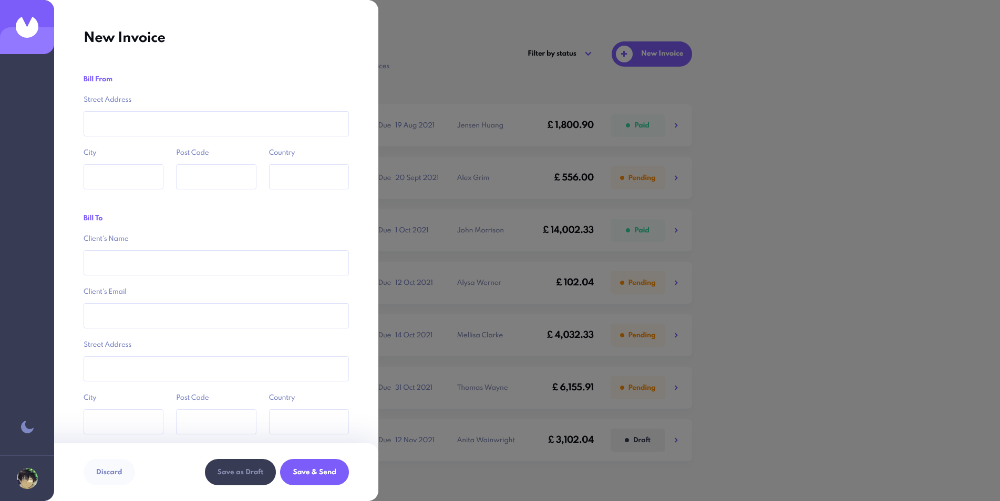

# Invoice App

## Links

-   Live Site URL: [Invoice App](https://kaleidoscopic-piroshki-9af0f5.netlify.app/)
-   Solution URL: [Github](https://github.com/Euuphi/invoice-app)

This is a solution to Front-end Mentor's [Invoice app challenge](https://www.frontendmentor.io/challenges/invoice-app-i7KaLTQjl).

## Table of contents

-   [Overview](#overview)
    -   [The challenge](#the-challenge)
    -   [Screenshot](#screenshot)
        [Features](#features)
-   [My process](#my-process)
    -   [Built with](#built-with)
    -   [What I learned](#what-i-learned)
    -   [Continued development](#continued-development)
    -   [Useful resources](#useful-resources)
-   [Author](#author)

**Note: Delete this note and update the table of contents based on what sections you keep.**

## Overview

### The challenge

Users should be able to:

-   Toggle light and dark mode
-   Create, read, update, and delete invoices
-   Filter invoices by status (draft/pending/paid)
-   Save draft invoices, and mark pending invoices as paid
-   Receive form validations when trying to create/edit an invoice
-   See hover states for all interactive elements on the page
-   View the optimal layout for the app depending on their device's screen size (in progress)

### Screenshot

Invoice List 
Invoice Details 
Invoice List (Dark Theme) .png>)
Invoice Details (Dark Theme) .png>)
Form 
Form Validation 

## My process

### Built with

-   [React](https://reactjs.org/) - JS library
-   [Next.js](https://nextjs.org/) - React framework
-   [Redux](https://redux.js.org/) - React state management library
-   [Mongoose](https://mongoosejs.com/docs/) - Library for connecting MongoDB and Express framework
-   [Styled Components](https://styled-components.com/) - For styles
-   Semantic HTML5 markup
-   Flexbox
-   CSS Grid
-   Desktop-first workflow

### Features

-   Creating an invoice
    -   Invoices can be created either as drafts or as pending. Clicking "Save as Draft" will allow the user to leave any form field blank. Clicking "Save & Send" requires all forms fields to be filled in.
    -   The `total` is calcuated by the sum of all items on the invoice.
-   Editing an invoice
    -   When saving changes to an invoice, all fields are required when the "Save Changes" button is clicked. If the user clicks "Cancel", any unsaved changes are reset.
    -   When "Save Changes" button is click. The invoice will be saved as "draft" if there are missing fields. Otherwise the status will be set to "pending".
-   Users are able to mark invoices as paid by clicking the "Mark as Paid" button. This changes the invoice's status to "paid".
-   Users will receive a confirmation modal when trying to delete invoices.

### What I learned

-   Implementing a dark theme toggle using styled components and react redux

```js
// actions.js

export const TOGGLE_DARKTHEME = "TOGGLE_DARKTHEME";

export const toggleDarkTheme = () => ({
    type: TOGGLE_DARKTHEME,
});
```

```js
// reducer.js

import * as preferencesActions from "stores/actions/preferencesActions";

const initialState = { darkThemeEnabled: false };

const preferences = (state = initialState, action) => {
    switch (action.type) {
        case preferencesActions.TOGGLE_DARKTHEME:
            return { ...state, darkThemeEnabled: !state.darkThemeEnabled };
        default:
            return state;
    }
};

export default preferences;
```

```js
// DarkThemeProvider.js

import { ThemeProvider } from "styled-components";
import { useSelector } from "react-redux";
// Themes
import { lightTheme } from "themes/lightTheme";
import { darkTheme } from "themes/darkTheme";

const DarkThemeProvider = ({ children }) => {
    const darkThemeEnabled = useSelector(
        (state) => state.preferences.darkThemeEnabled
    );
    return (
        <ThemeProvider theme={darkThemeEnabled ? darkTheme : lightTheme}>
            {children}
        </ThemeProvider>
    );
};

export default DarkThemeProvider;
```

-   Filter invoices based on their status

```js
// actions.js

import * as filterActions from "stores/actions/filterActions";

const initialState = { paid: "paid", pending: "pending", draft: "draft" };

const filterOptions = (state = initialState, action) => {
    // Toggle state of object key between input string or an empty string
    const toggleOption = (option) => {
        return state[option] === option ? "" : option;
    };

    switch (action.type) {
        case filterActions.FILTER_PAID:
            // Toggle state.paid between "paid" or "" (empty string)
            return { ...state, paid: toggleOption("paid") };
        case filterActions.FILTER_PENDING:
            return {
                ...state,
                pending: toggleOption("pending"),
            };
        case filterActions.FILTER_DRAFT:
            return { ...state, draft: toggleOption("draft") };
        default:
            return state;
    }
};

export default filterOptions;
```

-   Creating REST API with mongoose and MongoDB

```js
// dbConnect.js

import mongoose from "mongoose";

const connection = {};

async function dbConnect() {
    if (connection.isConnected) {
        return;
    }

    const db = await mongoose.connect(process.env.URI, {
        useNewUrlParser: true,
        useUnifiedTopology: true,
    });

    connection.isConnected = db.connections[0].readyState;
}

export default dbConnect;
```

```js
// index.js

import dbConnect from "utils/dbConnect";
import Invoice from "models/Invoice";

dbConnect();

const handler = async (req, res) => {
    const { method } = req;

    switch (method) {
        case "GET":
            try {
                const invoices = await Invoice.find({});

                res.status(200).json({ success: true, data: invoices });
            } catch (error) {
                res.status(400).json({ success: false, error });
            }
            break;
        case "POST":
            try {
                const invoice = await Invoice.create(req.body);

                res.status(201).json({ success: true, data: invoice });
            } catch (error) {
                res.status(400).json({ success: false, error });
            }
    }
};

export default handler;
```

```js
// [id].js

import dbConnect from "utils/dbConnect";
import Invoice from "models/Invoice";

dbConnect();

const handler = async (req, res) => {
    const {
        query: { id },
        method,
    } = req;

    switch (method) {
        case "GET":
            try {
                const invoice = await Invoice.findOne({ id });

                if (!invoice) {
                    return res.status(400).json({
                        success: false,
                        message: "No invoice matching query was found",
                    });
                }

                res.status(200).json({ success: true, data: invoice });
            } catch (error) {
                res.status(400).json({
                    success: false,
                    error,
                });
            }
            break;
        case "PUT":
            try {
                const invoice = await Invoice.findOneAndUpdate(
                    { id },
                    req.body,
                    {
                        new: true,
                        runValidators: true,
                    }
                );

                if (!invoice) {
                    return res.status(400).json({
                        success: false,
                        message: "No invoice matching query was found",
                    });
                }

                res.status(200).json({ success: true, data: invoice });
            } catch (error) {
                res.status(400).json({ success: false, error });
            }
            break;
        case "DELETE":
            try {
                const deletedInvoice = await Invoice.deleteOne({ id });

                if (!deletedInvoice) {
                    return res.status(400).json({
                        success: false,
                        message: "No invoice matching query was found",
                    });
                }

                res.status(200).json({ success: true, data: deletedInvoice });
            } catch (error) {
                res.status(400).json({ success: false, error });
            }
            break;
    }
};

export default handler;
```

-   Validate and track form inputs

```js
// Function for validating form input fields. Returns an object of which fields are still "required"
const validateInputs = (inputs) => {
    let errors = {};
    let errItems = [];

    for (const [name, value] of Object.entries(inputs)) {
        // Ignore id field
        if (name === "id") {
            errors.id = value;
            // Check array
        } else if (Array.isArray(value)) {
            value.forEach((item) => {
                errItems.push(validateInputs(item));
            });

            errors[name] = errItems;
            // If object
        } else if (typeof value === "object") {
            errors[name] = validateInputs(value);
            // If no value
        } else if (!value) {
            errors[name] = "required";
        }
    }

    return errors;
};
```

```js
// Function for checking form errors returned from input validation (validateInputs function)
// Returns and
const validateErrors = (errors) => {
    let validation = {};

    for (const [name, value] of Object.entries(errors)) {
        if (name === "id") {
            continue;
            // Check array
        } else if (Array.isArray(value)) {
            // If no items in array
            if (value.length === 0) {
                validation[name] = "no items";
            } else {
                value.forEach((item) => {
                    // Create array of item object keys
                    const keys = Object.keys(item);
                    if (keys.length === 1 && keys[0] === "id") {
                        return;
                    } else {
                        validation[name] = "error";
                    }
                });
            }
            // If object
        } else if (typeof value === "object") {
            if (Object.keys(value).length === 0) {
                continue;
            } else {
                validation[name] = "error";
            }
        } else {
            validation[name] = "error";
        }
    }

    return validation;
};
```

-   Creating modal for confirmation windows

### Continued development

I would like to implement and work more on the following concepts

-   Implementaion and use of TypeScript
-   Creating custom select input fields
-   Finishing mobile and tablet screen optimisation

### Useful resources

-   [Implementing Dark Theme](https://levelup.gitconnected.com/implementing-a-dark-theme-toggle-with-react-redux-and-styled-components-e637c4d41e2f) - This helped me when trying to implement a dark theme toggle.

## Author

-   Github - [Euuphi](https://github.com/Euuphi)
-   LinkIn - [Steven Nguyen](https://www.linkedin.com/in/steven-nguyen38/)
